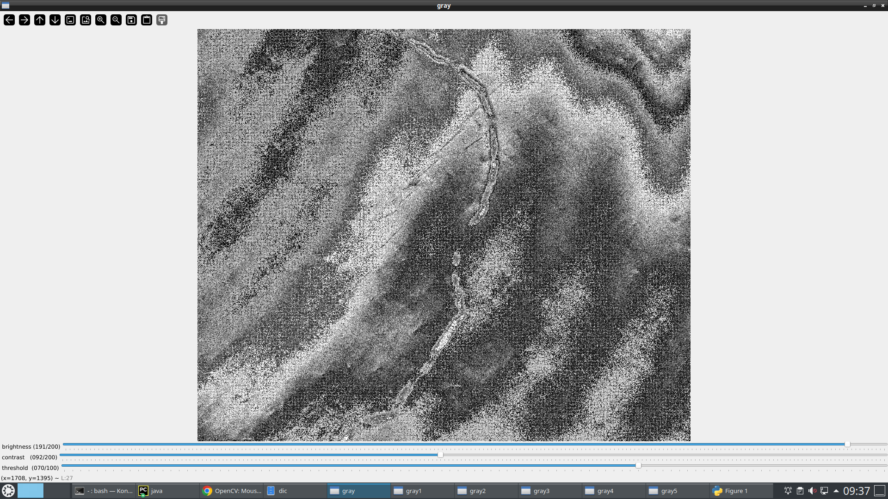
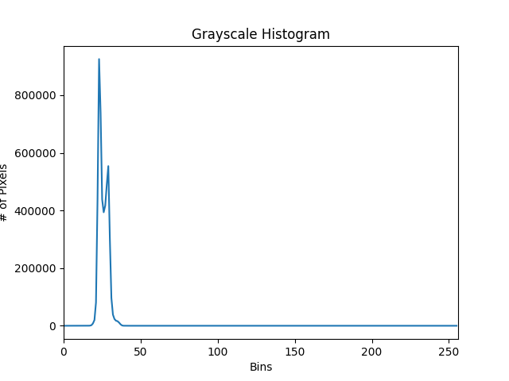

# SiCimage

[TOC]

------

SiCimage contains the data , source code and analysis code for SiC image data. This Readme.md provides the essential information to use the package. 

The features of this SiC algorithm includes:

- Utilizing opencv based image algorithm to get some SiC defect from picture. 

## Background of SiC

SiC image is an defect detection method that is widely applied in the area of many SiC data. 

## Example Picture demo



## Create Virtual Environment and requirement.txt
```
sudo apt-get install python3.8-venv / python3.x-venv
python -m venv SiCimage
source SiCimage/bin/activate
pip3 freeze > requirements.txt
